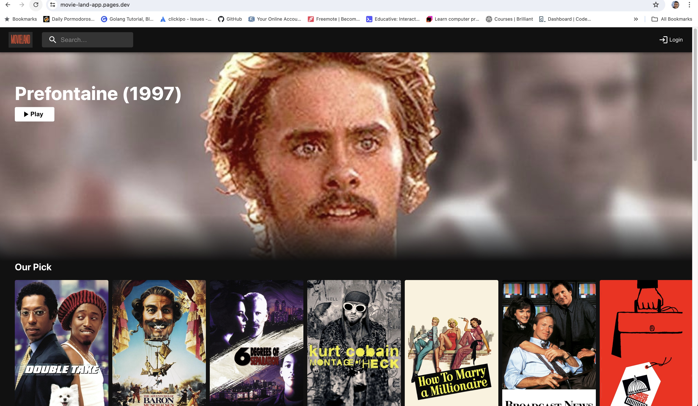
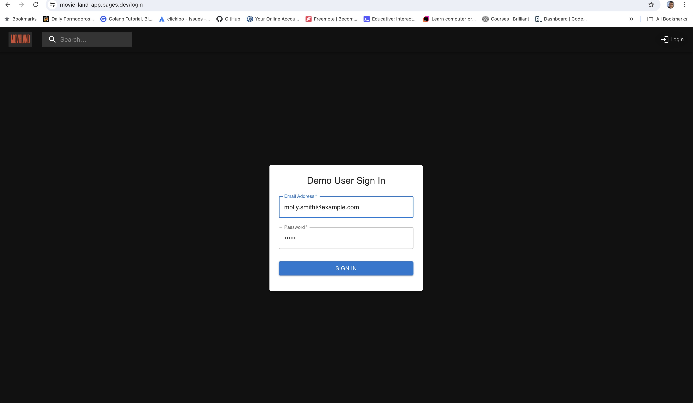
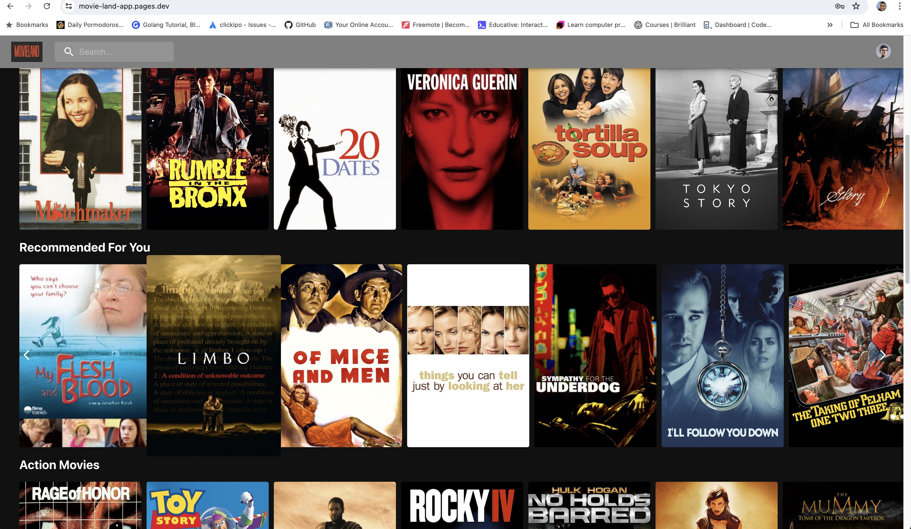
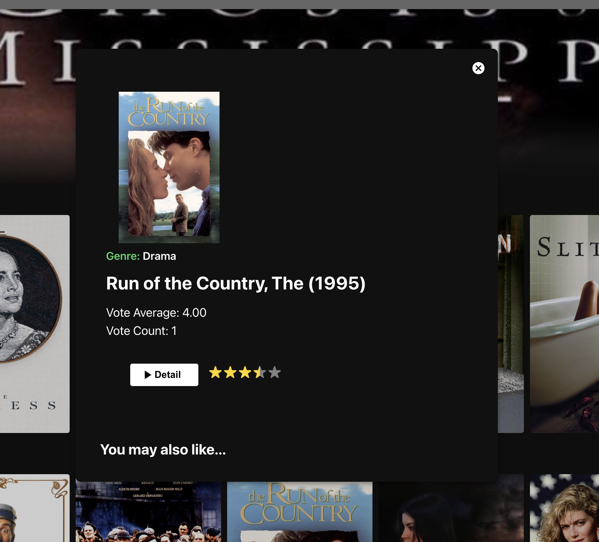

# Movie Recommender App

## Overview
The Movie Recommender App is designed to suggest movies to users based on their ratings and preferences.

## Technologies Used
### Backend
- **Python**: Used as the primary programming language.
- **FastAPI**: A modern, fast (high-performance) web framework for building APIs.
- **pandas**: Data manipulation and analysis library.
- **scipy.sparse**: Sparse matrix library.
- **implicit.als**: Alternating Least Squares algorithm for collaborative filtering.
- **pickle**: Used for serializing and deserializing the model.

### Frontend
- **React**: A JavaScript library for building user interfaces.
- **Material UI**: A popular React UI framework.

## Links to Repositories

- [Frontend Repository](https://github.com/iamme24cl/movie-land-app)

## Application Images

### Home Page

### Login Page

### Recommended Movies

### Search Movies

### Rate Movies

## License

This project is licensed under the MIT License. See the [LICENSE](LICENSE) file for more information.

### Contact Information
Feel free to reach out.

**Chandra Lama**  
Email: iamme24cl@gmail.com  
GitHub: [chandralama](https://github.com/chandralama)
